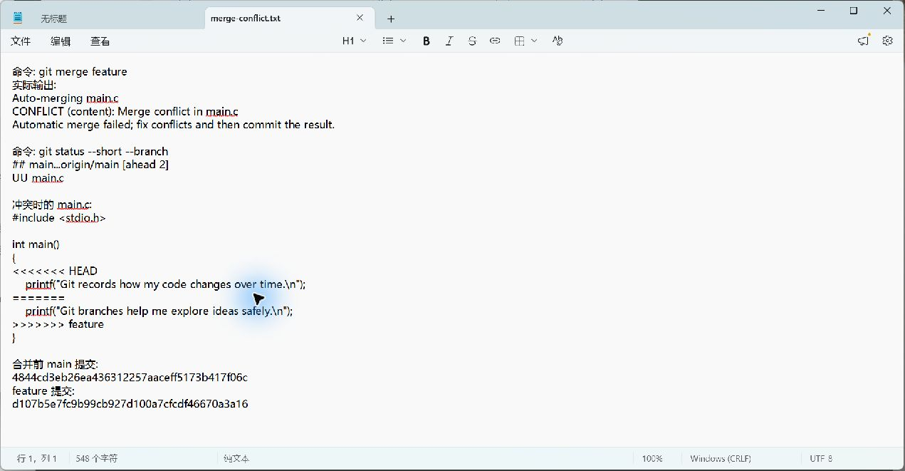
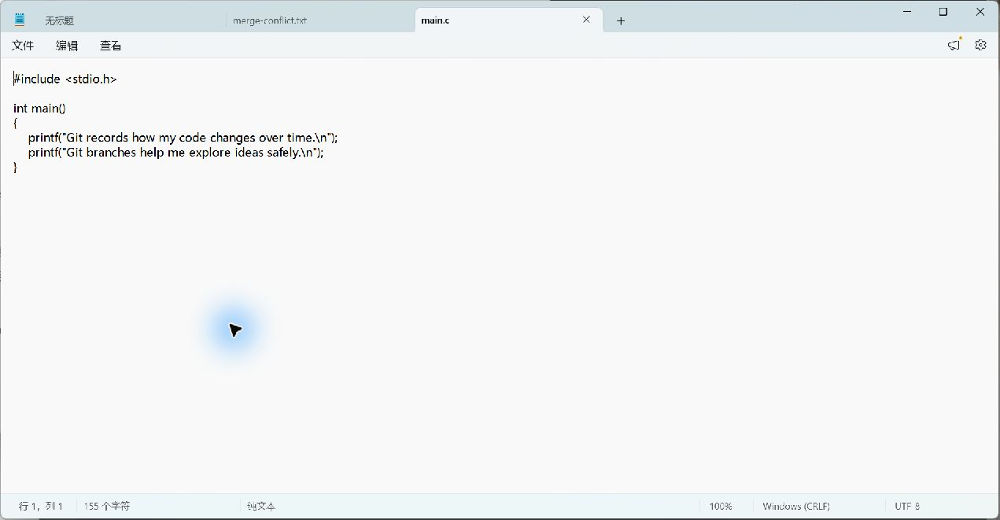

# Lab0：Git 实验报告

仓库：[yuxingwang517-gif/ICS-Github-2026](https://github.com/yuxingwang517-gif/ICS-Github-2026)

实验日期：2026 年 9 月 30 日

## 一、实验目的与环境

本实验使用课程指定的 `ICS-26Fall-FDU/GitLab` 模板创建个人公开仓库，练习 Git 的暂存、提交、分支、合并和冲突处理。实验在 Windows 上使用 Git 命令行进行。自动评分配置保留模板原内容。

## 二、文档问题

### 1. 之前有过多人协同开发经历吗？

没有。此次实验用 `main` 和 `feature` 两个分支模拟并行修改同一文件的情形；真正的多人协作还需要约定分工、共享远程仓库，并在合并前检查和沟通各自的更改。

### 2. Git 为什么设计“暂存—提交”两个步骤？

工作区的改动不一定都属于同一件事。例如同时修改了程序和报告时，可以先用 `git add main.c` 只暂存程序，再提交一条只描述程序修改的记录；报告稍后单独提交。暂存区因此让一次提交成为经过选择的、相对完整的变更，而不是把工作区的所有临时改动直接存入历史。提交前可用 `git diff --cached` 检查即将记录的内容。参见 [Git add 文档](https://git-scm.com/docs/git-add)。

### 3. `git branch` 与 `git branch -a` 有什么区别？

`git branch` 列出本地分支，当前分支前面有 `*`；`git branch -a` 同时列出本地分支和远程跟踪分支，例如 `remotes/origin/main`。远程跟踪分支是本地保存的远程分支状态，显示它不等于已经切换到远程分支。参见 [Git branch 文档](https://git-scm.com/docs/git-branch)。

## 三、阅读材料与理解

1. [《Commit message 和 Change log 编写指南》](https://www.ruanyifeng.com/blog/2016/01/commit_message_change_log.html)：提交说明应清楚表达本次修改的目的。文中介绍了用 `type(scope): subject` 等结构记录变更，使历史便于检索，并可据此生成变更日志。本实验的提交信息采用 `feat:` 等简短前缀。
2. [《语义化版本 2.0.0》](https://semver.org/lang/zh-CN/)：版本号按“主版本号.次版本号.修订号”表达变更性质。公开 API 出现不兼容变更时增加主版本号，兼容的新功能增加次版本号，兼容的错误修正增加修订号。

我理解学习 Git 的意义是：每次提交都能说明“改了什么、为什么改”，分支让不同想法并行推进，合并机制帮助定位并处理相互影响的修改。版本历史也让排查错误和回顾实验步骤有据可查。

## 四、实验步骤

1. 从[课程模板仓库](https://github.com/ICS-26Fall-FDU/GitLab)点击 **Use this template** 创建个人仓库，没有使用 Fork；克隆个人仓库到本地。
2. 修改 `main.c` 中的 TODO 输出，将原来的 `Hello, world!` 改为自定义句子，并在 `main` 分支提交 `4a6e7f1`。
3. 用 `git switch -c feature` 新建并切换到 `feature`；修改同一条 `printf`，提交 `d107b5e`。
4. 切回 `main`，对同一条 `printf` 作不同修改，提交 `4844cd3`。
5. 在 `main` 执行 `git merge feature`。Git 报告 `CONFLICT (content): Merge conflict in main.c`，`git status --short` 显示 `UU main.c`。两条分支都改了共同祖先中的同一行，所以 Git 无法自动决定保留哪一种文字。
6. 检查冲突标记 `<<<<<<< HEAD`、`=======`、`>>>>>>> feature`；在最终文件中保留两条有意义的输出，删除冲突标记。使用 `git add` 标记冲突已解决，并产生含两个父提交的合并提交 `63c486e`。

合并关系如下，左右两侧的提交分别来自 `main` 和 `feature`：

```text
*   63c486e merge: resolve conflicting Git messages
|\
| * d107b5e feat: describe branch practice
* | 4844cd3 feat: describe commit history
|/
* 4a6e7f1 feat: personalize the greeting
* fd47e9c Initial commit
```

## 五、冲突证据与解决结果

冲突发生后，我保存了 Git 的原始输出及当时 `main.c` 中的冲突标记；[原始文本](evidence/merge-conflict.txt)还保留了两侧提交的 SHA。下图是用记事本打开这份记录时截取的实际窗口画面，可以看到 `CONFLICT (content)`、`UU main.c` 和冲突标记。它记录的是已保存的原始内容，不是执行 `git merge` 当时的终端现场截图。



最终 `main.c` 的关键部分为：

```c
printf("Git records how my code changes over time.\n");
printf("Git branches help me explore ideas safely.\n");
```

这两行分别保留了 `main` 和 `feature` 的内容；最终文件中不再有冲突标记。提交历史中的合并节点证明两个分支已经汇合。程序的输出也不再等于模板的 `Hello, world!`。

下图是用记事本打开解决冲突后的 `main.c` 时截取的窗口画面，显示两条输出均已保留。



## 六、结果与体会

实验完成了模板建仓、首次修改、分支提交以及真实冲突合并。`git diff --check` 用于检查改动中的空白错误。推送到 GitHub 后，[`main` 分支的自动评分运行](https://github.com/yuxingwang517-gif/ICS-Github-2026/actions/runs/36730217537)已成功，日志显示 `Hello World Modified` 测试 1/1 通过，自动评分为 100/100。报告部分仍由助教单独评分。

我认识到冲突不是文件损坏，而是 Git 无法替开发者判断两个修改的取舍。解决时应先读懂两边的意图，再选择或组合内容，检查文件后再提交。

建议：初学者在每次切换分支前运行 `git status`，避免把尚未提交的修改带到另一分支；提交信息尽量写明修改目的，便于回看历史。
